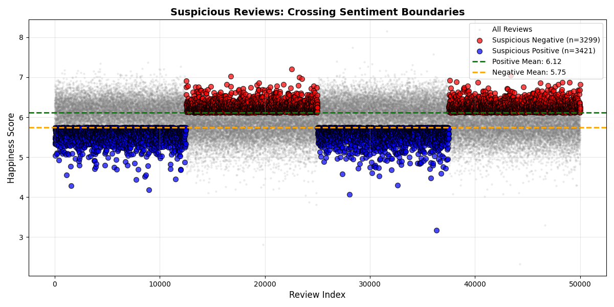
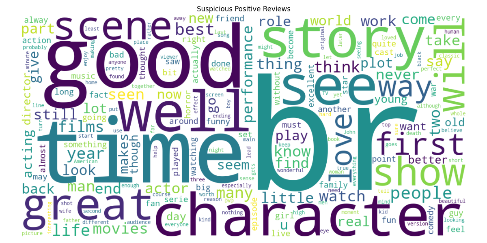

# Hedonometer-Grp-Project

1. Happiness According to Mechanical Turks: Exploring the Hedonometer Dataset

This project explores the labMT 1.0 dataset used to measure happiness in language. Using Python, we analyze the distribution of happiness scores, disagreement between raters, and differences in word usage across several text corpora such as Twitter, Google Books, the New York Times, and song lyrics. By combining quantitative analysis with qualitative interpretation, we examine how emotional meaning is reflected in everyday language.

Research question: 

To what extent do the Hedonometer happiness scores align with the IMDb sentiment labels, and what factors create the gap between them? 

In assignment 1, we focused on labMT 1.0 as an object of study. For this project, we used it as a measurement instrument to evaluate its performance in practice. We choose to apply Hedonometer to the Stanford IMDb Large Movie Review Dataset, which contains 50,000 movie reviews written by real people and were already labeled as either “Positive” or “Negative”. 

We chose this research question for two main reasons. First, movie reviews present a linguistic context that is difficult to interpret with lexical methods. The Hedonometer uses a standard bag of words approach, calculating happiness by looking at words individually. However, people tend to use complex language in their reviews, such as sarcastic words and contextual meanings. This can lead to the difference between the Hedonometer score and the actual sentiment expressed by reviewers. 

Second, moving beyond simply focusing on the accuracy of the Hedonometer, we want to measure the gap between IMDb sentiment labels and the Hedonometer scores, as well as study the cause of this gap. Particularly, we concentrate on factors such as sarcasm and the use of words in movie reviews. By using statistical methods and data visualization, we highlight both strengths and limitations of dictionary-based sentiment tools.     

2. Dataset and data dictionary

We used df_read.csv to read the txt. file into a pandas dataframe, removed metadata and converted it the file into a csv, putting a desired path destination which is data/processed.
   
The dataset contains 8 columns and 10,222 rows excluding the header. Each of last four columns (twitter_rank, google_rank, nyt_rank_lyrics) have 5222 values missing: Dodds et al. clarify that they only ranked the top 5000 frequent words, hence the missing values.

- word: what word is being rated/inspected (string)
- happiness_rank: ranking from indicating most happiness to least (integer)
- happiness_average: the average score of how close to 'happiness' the word is, made by AMT (float)
- happienss_standard_deviation: how much disagreement there is to this crowd-sourced ranking from the rest of the crowd (float)
- twitter_rank: frequency ranking (float)
- google_rank: frequency ranking (float)
- nyt_rank: frequency ranking (float)
- lyrics: frequency ranking (float)

Regarding data quality, there are no duplicates and the word format (spacing, lowercase) stays consistent. Word selection seems to encompass wide spectrum of meanings - every day objects, terminology, verbs, adjectives, material and abstract etc. Although, there are no duplicates, half of the top 10 happiness-indicating words stem from the core 'laugh': verb - base, continous, past forms - and the noun. One could view this as a downgrade to the data quality, however, as deviations of the same core hold differing scores, one can argue they might hold some relevance to their perception

Most of the top ten 'happiness' words are unarguably ones we would expect. Interestingly, laughter tops the word happiness itself, perhaps because of it being an act embodying the feeling, affording us to give it a material reality. 
The least happiness containing words are connotated with death, which has its own happiness score. Interestingly, suicide ranks higher in negativity than other forms/directions of killing. Personally, I also understand that rape is ranked to be more negative than acts of killing due to its gruesome nature.

Most of the top ten 'happiness' words are unarguably ones we would expect. Interestingly, laughter tops the word happiness itself, perhaps because of it being an act embodying the feeling, affording us to give it a material reality. 
The least happiness containing words are connotated with death, which has its own happiness score. Interestingly, suicide ranks higher in negativity than other forms/directions of killing. Personally, I also understand that rape is ranked to be more negative than acts of killing due to its gruesome nature.

IMDb Large Movie Review Dataset

The project used the IMDb Movie Review Dataset, consisting of 50,000 reviews in total. To establish clear sentiment labels, Maas et al. (2011) filtered the data based on the users’ original out of 10 star ratings. A review was labeled negative if it scored 4 or lower, and positive if it scored 7 or higher. There is no neutral review in the dataset. The data is evenly split into 25,000 training reviews and 25,000 testing reviews.

The IMDb dataset is suitable for this research because it provides clear sentiment labels for each user’s review. These labels can be used as a benchmark to evaluate if the Hedonometer happiness scores can produce similar sentiment interpretations. Movie reviews have complex language, such as praise or sarcasm. As the Hedonometer calculates happiness based on isolated word scores, the expressive language in movie reviews helps to examine the ability of the Hedonometer. Then we can identify and analyze the gap between the word average happiness and the sentiment label. 

3. Method

Loading and cleaning the dataset:

Skiprows were used in order to leave out top columns containing metadata. In order to convert all columns into numeric types, we used na_values and listed "--" to be perceived as Not a Number (NaN) because up until then "--" was not recognized as a NaN and the system thus perceived the columns as object dtype. By using df.info() and df.isna().sum(), the results are going to show us non-null count - not empty values -, dtype, and amount of missing values in each column.

Tools and Libraries:

- Python
- Pandas
- Matplotlib
- Seaborn

4. Result
   
4.1. Distribution of Happiness Scores.

Figure 4.1 The distribution historgam of Happiness Scores. 

| Statistic | Value |
|-----------|-------|
| Mean happiness score | 5.38 |
| Median happiness score | 5.44 |
| Standard deviation | 1.08 |
| 5th percentile | 3.18 |
| 95th percentile | 7.08 |

Interpretation: 
Looking at the histogram, the happiness scores are slightly above neutral with the highest concentration of words between 5 and 6. The mean (5.38) and the median (5.44) are close, showing a symmetric distribution. As the mean is smaller than the median and the left tail is longer than the right one, the distribution is mild left skew. The left long tail of negative scores also pull the overall average down. Moreover, with the highest density between 4.5 and 6.5 scores, the histogram indicates that many words in labMT 1.0 are considered neutral or moderately positive.

The surprising pattern is that no word gets an absolute score such as 1 or 9. It is interesting that out of numerous words, people were unable to agree on any words that are absolutely positive or negative. The interpretation of words depends on context or cultural background, which leads individuals to perceive the same words in different ways. Therefore, the rating scores from many participants seem to be neutral in labMT 1.0. 

4.2 Top 5 contested words.

| word        | happiness_average | happiness_standard_deviation |
|-------------|------------------|------------------------------|
| fucking     | 4.64             | 2.9260                       |
| pussy       | 4.80             | 2.6650                       |
| whiskey     | 5.72             | 2.6422                       |
| capitalism  | 5.16             | 2.4524                       |
| mortality   | 4.38             | 2.5546                       |

Interpretation: 
- 'Fucking' is considered highly negative and aggressive in its meaning. Some people use it to curse or swear at other people, so it gets a low score. However, in modern society, it is also used as a positive intensifier to express an individual's feelings such as "This is fucking amazing!". Therefore, young teenagers rate this word with high score, creating a massive contradiction in data.

- The reason for the disagreement over 'Pussy' is that it has various conflicting meanings. According to English dictionaries, it can be a harmless word for a cat. Otherwise, it can have vulgar slang meanings, such as a woman's genital or a weak and cowardly man. With each meaning that has different scores, this word becomes controversial.

- 'Whiskey' has many disagreements due to differences in culture. Many individuals consider whiskey a drink for entertainment, relaxation, and socialization, so they rate it with a positive score. While the others associate whiskey with alcoholism and destructive behaviors, giving it a low score. 

- The word 'Capitalism' is a political and economic term. It creates a controversial conversation because of the distinction in ideologies among individuals. Depending on the rater's politics, it can refer to wealth, freedom and innovation or greed, poverty and inequality.

- 'Mortality' is chosen to be in the top 5 of contested words in data. For some people, mortality can bring them many benefits such as long life, power and experience. They will give a high score to this word. However, the others link this word with loneliness, death and loss. They think when they become mortal, they have to watch their beloveds die. This leads to a low score. The opposite perspectives creates the contradictory data.

Figure 4.2. The scatterplot of Happiness Scores.  

Connecting qualitative interpretation to quantitative pattern:

In the scatterplot, the data forms a flower shape, which reflects the variety of agreement and disagreement in different ranges of the scores. First, looking at the left and right edges of the plot, the small density of points clusters around low standard deviation. This means that words with very low and high average happiness scores have a tendency to have a significant agreement among participants. For example, to achieve a high score such as 8.5, every individual needs to rate 8.0 or 9.0 for that word.

Second, the highest points of standard deviation cluster around the center of the X-axis, between 4.0 and 6.0 scores. These words are considered controversial, because people interpret their meanings differently. Some participants give them low scores, while the others rate them with high scores. These opposite ratings are averaged together; therefore, the results appear to be neutral but produce a high standard deviation. 

Finally, the dense clusters of points are in the bottom center of the plot, between 5.0 and 6.0 scores. These words are neither strongly negative nor strongly positive to the participants, so they gave scores around the middle of the scale. Despite the variation in individuals’ opinions, the disagreement is moderate, leading to both average happiness scores and mid-range standard deviation.

4.3 Corpus Comparison

Each corpus contributes 5,000 words to the labMT dataset, but the overlap between them is limited. Only 1,816 words appear in all four corpora, and 2,881 words overlap between Twitter and the New York Times. This shows that “common language” depends on the source.

The bar chart shows that each corpus contributes 5,000 words, but the overlap calculations reveal that many of these words are not shared across corpora. Twitter reflects current public conversation, while Google Books represents language across long historical periods.

One example is the word “republicans.” It appears in Twitter’s top 5,000 words but not in Google Books. This likely reflects the immediacy of political discussion on social media. In contrast, Google Books averages language over many decades, where specific contemporary party references are less dominant.

5. Qualitative exploration

5.1 Word exhibit (20 selected words)

| Word | Category | Explanation |
|------|----------|-------------|
| laughter | very positive | associated with joy and social bonding |
| happiness | very positive | represents a positive emotional state |
| love | very positive | universal symbol of affection |
| joy | very positive | expresses strong happiness |
| smile | very positive | linked to positive emotions |
| death | very negative | associated with loss and fear |
| suicide | very negative | connected to tragedy and despair |
| rape | very negative | represents violence and trauma |
| killing | very negative | associated with violence |
| murder | very negative | strongly negative violent act |
| fucking | highly contested | insult but also positive intensifier |
| pussy | highly contested | cat vs vulgar slang |
| whiskey | highly contested | leisure vs alcoholism |
| capitalism | highly contested | political ideology interpreted differently |
| mortality | highly contested | philosophical vs negative meaning |
| republicans | culturaly loaded | political identity word |
| religion | cultural loaded| faith vs conflict interpretations |
| money | cultural loaded| wealth vs greed |
| freedom | cultural loaded| positive but politically contested |
| power | cultural loaded | authority vs oppression |

5.2 Interpretation

The selected words highlight that the way people feel about words depends heavily on context and culture. Words such as 'laughter', 'love', and 'joy' have high happiness scores because they are usually connected to positive feelings and social interaction. In contrast, words like 'death', 'suicide' and 'rape' have very low happiness scores since they are related to violence, loss and suffering. However, some words have evry different meanings for different people. Words such as 'fucking', 'pussy' show how the meaning of the word can change depending on the situation and the group of people using it. As an example, 'fucking' can be used as an insult, but it can also be used to strongly emphasize something positive, like in the phrase 'this is fucking amazing'. Political and cultural words such as 'capitalism', 'religion' and 'republicans' can also cause disagreement. People may understand these words in various ways depending on their political views, culture, or personal experiences. This illustartes that the emotional meaning of words is not fixed and can change depending on who is using them and in what context. These observations also match the quatitative results. Words with very high or very low happiness scores usually have less disagreement between people. In contrast, highly contested words are often located in the middle of the happiness scale and show higher disgreement. This pattern can also be seen in the scatterplot, where disagreement is highest around neutral happiness scores.

6. Critical reflection: how was this dataset generated, and why does it matter?

6.1 
In order to understand the labMT 1.0 dataset, it is important for us to reconstruct its "biography", the specific sequence of steps that transformed raw, organic language into a well curated set of mathematical scores. This process began with the selection of four diverse sources of English text to ensure a broad and correct representation of language: Twitter was chosen for it’s social, in-the-moment expressions, Google Books was chosen for it’s historical and literary context, the New York Times for it’s institutional news and lastly Music Lyrics for pop culture and more emotional depth. Rather than choosing words based on their prior emotional definitions, the authors gathered the top 5,000 most frequent words from each source. This resulted in a union of 10,222 unique words, ensuring the instrument measured the actual language people use in daily life.
Following the creation of this word list, the authors used Amazon’s Mechanical Turk to get human evaluations. Every word was rated by 50 participants on a scale of 1 to 9, aided by stylized faces representing a spectrum from sad to happy. These evaluations were averaged to create the final havg score for each word, along with a standard deviation to track rater disagreement. To refine the instrument, the authors intituted a "neutral zone" filter, signifyed as Δhavg, which keeps out emotionally neutral words that function as what could be named "noise" in the data. Through rigorous trials, they determined that Δhavg=1, removing the words with scores between 4 and 6, provided the perfect middle ground between instrument sensitivity and the text coverage.

6.2 
The design choices made while making the creation of the Hedonometer have significant consequences for what the instrument is both able and not able to see. By building the word list solely on usage frequency, the authors made a tool that is great at measuring the "ambient" mood of a general population but lacks the resolution to detect rare, highly specific emotional triggers. For instance, common function words like "the" and "of" are included due to their frequency, despite being emotionally neutral, while rare but potent words may be excluded entirely.
Furthermore, the "bag-of-words" simplification, where the algorithm treats text as a collection of individual words while ignoring grammar, negation and order of the words, means that crucial context is lost. This makes the instrument fallible when analyzing small texts, such as single sentences, where it is not able to distinguish the difference between "happy" and "not happy". There is also a distinct "snapshot in time" limitation, for example because ratings were collected in 2011, the emotional associations are treated as static, failing to take into account how meanings can differ over time. A good example is the word "lost," which received a quite low happiness score partly because of its frequency spiked during the airing of a popular television show's finale rather than reflecting a general societal depression.
Finally, the instrument must take into account the inherent positivity bias of the English language. Because humans usually try to use more positive words rather than negative ones in natural corpora, a mathematically "neutral" score of 5.0 is actually below the true linguistic average. This bias is visible in the distribution of word scores, which skews significantly toward the right. Also, the choice to avoid "stemming", counting "love" and "loved" as different entries, preserves nuance but can result in inconsistent scoring for the same concept. For example, the verb "have" and its past tense "had" have quite different happiness scores, this likely reflects the types of sentences they are used in rather than a shift in the word's fundamental meaning.

6.3 
If we would deploy the labMT 1.0 Hedonometer today, we would do so with significant caveats regarding its validity and scope. We trust this instrument to measure macro-scale, exhibited tone in massive datasets where the volume of words outweighs the errors found in individual sentences. It would remain to be a powerful "remote sensor" for identifying the collective emotional footprint of global events, such as for example holidays or disasters, seeing as they are reflected in written public expression. However, we refuse to use this dataset to assess the mental health of individuals or to make claims about "inner" emotional states, as the "bag-of-words" approach is too crude for actual clinical application. To modernize the instrument for 2026, we would recommend to incorporate n-grams to capture negation and implementing dynamic updates to word scores to reflect on and see how modern slang and cultural meanings have been able to evolve since the original 2011 survey.

7. How to run your code.
   
Set up steps:

Before running the project, you must install the required Python libraries to handle data and draw the chart.

- Open your terminal.
- Installed required packages: pandas, matplotlib, requirement.txt.

Scripts to run:
- In your terminal, you need to be inside the src folder. 
- This project is divided into four separate Python files:
 The 1_attempt file loads the file, creates the data dictionary, and performs sanity checks.
 The distributions_disagreement_of_happiness_score file generates the histogram and scatterplot visualizations. 
 The Corpus_comparison file produces the corpus comparison chart.
Word_exhibit shows the exhibition of the 20 words selected across categories. 

8. Credits.
   
Reference :
Dodds, Peter Sheridan, Kameron Decker Harris, Isabel M. Kloumann, Catherine A. Bliss, and Christopher M. Danforth. “Temporal Patterns of Happiness and Information in a Global Social Network: Hedonometrics and Twitter.” PLoS ONE 6, no. 12 (December 7, 2011): e26752. https://doi.org/10.1371/journal.pone.0026752.

Who did what roles:
Lien Phuong: 2
Quynh Nguyên: 3, 4.1, 4.2, 7
Ran Kim: 1, 4.3
Seo Yeon Kim: 5
Mila Clausen: 6.1, 6.2, 6.3

Part 2
## Data Acquisition

This project uses the IMDB Large Movie Review Dataset.

Source:
https://ai.stanford.edu/~amaas/data/sentiment/

The dataset contains 50,000 movie reviews labeled as positive or negative.

The raw dataset was downloaded and processed using a Python script:
src/fetch_imdb.py

This script converts the raw IMDB text files into a structured CSV dataset.

The processed dataset is saved as:
data/processed/imdb_reviews.csv

## Ethical Considerations:
The dataset consists of publicly available movie reviews.  
No personal identifiers are included. The analysis focuses only on aggregate linguistic patterns and does not attempt to identify or profile individual users.

## Dataset Structure

The processed dataset contains the following columns:

split – indicates whether the review belongs to the training or test set  
sentiment – the review label (pos or neg)  <- neg: 0-4/10, pos: 7-10/10 based on the stanford paper
review – the full text of the movie review  

Total number of reviews: 50,000

## Hedonometer Measurement Method

## Tokenization & Sentiment Pipeline

Raw Review  
↓  
Tokenization  
↓  
Word Tokens  
↓  
Lexicon Matching  
↓  
Happiness Scores  
↓  
Average Score  
↓  
Final Output

Example entries from the lexicon:

| Word | Happiness Score |
|-----|------|
| love | 8.42 |
| happy | 8.30 |
| murder | 1.48 |

Only tokens present in the lexicon contribute to the document’s happiness score.

The computed scores were saved in the processed dataset:
data/processed/imdb_reviews_scored.csv

This dataset contains the original review text along with the calculated happiness_score for each document. These scores were used for the statistical analysis and visualizations presented in the following sections.

## Sampling plan and results

In this part, we created a sampling strategy, quantified uncertainty through boostrapping and made relevant plots to the sample to visualize happiness scores of positive and negative reviews and outgroups. Within our research, we ask whether the hedonometer can accurately identify positive and negative reviews by searching for special case reviews that use for example sarcasm.

Sampling Plan
We decided to sample the entire dataset for precise calculations. The dataset contains equal amount of training, testing, positive, and negative reviews - meaning it is already balanced. While boostrapping 1000 times, we calculated the positive and negative mean happiness score. Afterwards, we searched for number of positive and negative reviews which score higher than the mean of their counterpart category. 

Key statistics from bootstrap analysis

The Hedonometer distinguishes positive and negative reviews with a mean difference of 0.37 (95% CI: [0.36, 0.37]). Although the confidence intervals are narrower due to the bigger sample size, considering that the dataset consists of extremely negative and positive reviews, one would assume the mean difference of these categories to be bigger. This leads us to reflect the appropriateness of using hedonometer as a method.

In total there were 3299 negative reviews found, which scored higher in happiness than the positive mean, making up 13.2% of all negative reviews. Regarding positive reviews, there are 3421 found scoring in happiness lower than the negative mean, making up 13.7% of all positive reviews. The reason for such results could be due to the reviewer's vocabulary, particularly use of sarcasm or overly expressive language. 

## Suspicious Positive Reviews Word Cloud

This word cloud highlights the most frequent words in reviews labeled as positive but associated with relatively low happiness scores according to the hedonometer. The prominence of terms such as “good,” “character,” “story,” and “show” suggests that these reviews are not strongly enthusiastic. Instead, they tend to rely on neutral, descriptive, or mixed evaluative language. This pattern indicates a mismatch between sentiment labels and linguistic tone, where reviews can be classified as positive while still containing critical, ambiguous, or only moderately positive expressions.

## Data visualization

To answer our research question, we created a boxplot to have a better data visualization for interpretation. It illustrates a comparison of the distribution of the happiness scores across IMDb reviews. First, the Hedonometer is accurate as you can see that the median happiness score for positive reviews (around 6.2) is higher than negative reviews (around 5.8). This shows that positive reviews have words with higher happiness value. 

Second, the boxplot highlights important limitations in the Hedonometer's accuracy for this dataset. Because of the overlap in the interquartile ranges, happiness scores, such as 6, could belong to negative or positive reviews. This overlap leads to ambiguous sentiment classifications. 

Finally, the numerous outliers in boxplot present the inconsistency between IMBd sentiment labels and Hedonometer scores. For instance, a positive review has a low happiness score, which is below 4. The unusual pattern demonstrates that the Hedonometer can misinterpret sentiment in some contexts. 

Distribution of Hedonometer Scores for Positive and Negative reviews.

