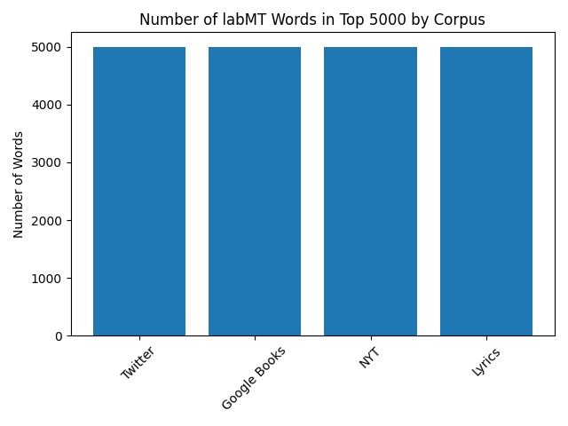

# Hedonometer-Grp-Project

2. Dataset and data dictionary

1.1 Loading the file

We used df_read.csv to read the txt. file into a pandas dataframe. In order to convert all columns into numeric types, we used na_values and listed "--" to be perceived as Not a Number (NaN). In the end we converted te txt. file into a csv with df.to_csv. In the code, by printing df.info() and df.isna().sum() the results are going to show us non-null count, dtype and amount of missing values in each column.
   
The dataset contains 8 columns and 10222 rows excluding the header. Each of last four columns (twitter_rank, google_rank, nyt_rank_lyrics) have 5222 values missing: Dodds et al. clarify that they only ranked the top 5000 frequent words.

1.1 Data dictionary:

- word: what word is being rated/inspected (string)
- happiness_rank: ranking from indicating most happiness to least (integer)
- happiness_average: the average score of how close to 'happiness' the word is, made by AMT (float)
- happienss_standard_deviation: how much disagreement there is to this crowd-sourced ranking from the rest of the crowd (float)
- twitter_rank: frequency ranking (float)
- google_rank: frequency ranking (float)
- nyt_rank: frequency ranking (float)
- lyrics: frequency ranking (float)

1.2 Sanity checks

Regarding data quality, there are no duplicates and the word format (spacing, lowercase) stays consistent. Word selection seems to encompass wide spectrum of meanings - every day objects, terminology, verbs, adjectives, material and abstract etc. Although, there are no duplicates, half of the top 10 happiness-indicating words stem from the core 'laugh': verb - base, continous, past forms - and the noun. One could view this as a downgrade to the data quality, however, as deviations of the same core hold differing scores, one can argue they might hold some relevance to their perception

Most of the top ten 'happiness' words are unarguably ones we would expect. Interestingly, laughter tops the word happiness itself, perhaps because of it being an act embodying the feeling, affording us to give it a material reality. 
The least happiness containing words are connotated with death, which has its own happiness score. Interestingly, suicide ranks higher in negativity than other forms/directions of killing. Personally, I also understand that rape is ranked to be more negative than acts of killing due to its gruesome nature.

Most of the top ten 'happiness' words are unarguably ones we would expect. Interestingly, laughter tops the word happiness itself, perhaps because of it being an act embodying the feeling, affording us to give it a material reality. 
The least happiness containing words are connotated with death, which has its own happiness score. Interestingly, suicide ranks higher in negativity than other forms/directions of killing. Personally, I also understand that rape is ranked to be more negative than acts of killing due to its gruesome nature.

4. Result section
   
2.1. Distribution of Happiness Scores.

Figure 4.1 The distribution historgam of Happiness Scores. 

Mean happiness score: 5.38
Median happiness score: 5.44
Standard deviation of happiness score: 1.08
5th percentile of happiness score: 3.18
95th percentile of happiness score: 7.08

Interpretation: 
Looking at the histogram, the happiness scores are slightly above neutral with the highest concentration of words between 5 and 6. The mean which is 5.38 and the median which is 5.44 are close. This shows a symmetric distribution. However, the mean is smaller than the median because it is pulled down by an amount of negative words on the left side of the chart. The left tail is longer than the right one, emphasizing the mild left-skewed distribution. Despite the majority of neutral and positive words, the negative words extend the lower end of the scale. Most of the tallest blue bars are centered between 4.5 and 6.5 scores. Many words in the middle of the bar chart are considered neutral by people. The surprising pattern is that no word gets an absolute score such as 1 or 9. It is interesting that out of numerous words, people were unable to agree on any words that are absolutely positive or negative. 

2.2 Top 5 contested words.

                word  happiness_average  happiness_standard_deviation
8425         fucking               4.64                        2.9260  
8019           pussy               4.80                        2.6650
3769         whiskey               5.72                        2.6422
6389      capitalism               5.16                        2.4524
8796       mortality               4.38                        2.5546

Interpretation: 
- 'Fucking' is considered highly negative and aggressive in its meaning. Some people use it to curse or swear at other people, so it gets a low score. However, in modern society, it is also used as a positive intensifier to express an individual's feelings such as "This is fucking amazing!". Therefore, young teenagers rate this word with high score, creating a massive contradiction in data.

- The reason for the disagreement over 'Pussy' is that it has various conflicting meanings. According to English dictionaries, it can be a harmless word for a cat. Otherwise, it can have vulgar slang meanings, such as a woman's genital or a weak and cowardly man. With each meaning that has different scores, this word becomes controversial.

- 'Whiskey' has many disagreements due to differences in culture. Many individuals consider whiskey a drink for entertainment, relaxation, and socialization, so they rate it with a positive score. While the others associate whiskey with alcoholism and destructive behaviors, giving it a low score. 

- The word 'Capitalism' is a political and economic term. It creates a controversial conversation because of the distinction in ideologies among individuals. Depending on the rater's politics, it can refer to wealth, freedom and innovation or greed, poverty and inequality.

- 'Mortality' is chosen to be in the top 5 of contested words in data. For some people, mortality can bring them many benefits such as long life, power and experience. They will give a high score to this word. However, the others link this word with loneliness, death and loss. They think when they become mortal, they have to watch their beloveds die. This leads to a low score. The opposite perspectives creates the contradictory data.

Figure 4.2. The scatterplot of Happiness Scores.  

Connecting qualitative interpretation to quantitative pattern:

In the scatterplot, a fascinating pattern emerges. The words with the highest standard deviation scores have average happiness scores centering in the middle of bar chart. The scatterplot shows that the highest dots are clustered in the center between 5 and 6. This creates a mathematical sense because these words are divided. They received many low scores from individuals who hate them and numerous high scores from people who have positive impressions of them. When we average those opposite data together, they cancel each other out, creating the final score that seems to be neutral.

2.3 Corpus Comparison

Each corpus contributes 5,000 words to the labMT dataset, but the overlap between them is limited. Only 1,816 words appear in all four corpora, and 2,881 words overlap between Twitter and the New York Times. This shows that “common language” depends on the source.

Even though the bar chart shows equal counts, the overlap numbers reveal real differences. Twitter reflects current public conversation, while Google Books represents language across long historical periods.

One example is the word “republicans.” It appears in Twitter’s top 5,000 words but not in Google Books. This likely reflects the immediacy of political discussion on social media. In contrast, Google Books averages language over many decades, where specific contemporary party references are less dominant.
>>>>>>> 0ad074e55b874320e5f07e459a6c55a3d5f4cc8a

5. Qualitative exploration

3.1 Word exhibit (20 selected words)

| Word | Category | Explanation |
|------|----------|-------------|
| laughter | very positive | associated with joy and social bonding |
| happiness | very positive | represents a positive emotional state |
| love | very positive | universal symbol of affection |
| joy | very positive | expresses strong happiness |
| smile | very positive | linked to positive emotions |
| death | very negative | associated with loss and fear |
| suicide | very negative | connected to tragedy and despair |
| rape | very negative | represents violence and trauma |
| killing | very negative | associated with violence |
| murder | very negative | strongly negative violent act |
| fucking | highly contested | insult but also positive intensifier |
| pussy | highly contested | cat vs vulgar slang |
| whiskey | highly contested | leisure vs alcoholism |
| capitalism | highly contested | political ideology interpreted differently |
| mortality | highly contested | philosophical vs negative meaning |
| republicans | culturaly loaded | political identity word |
| religion | cultural loaded| faith vs conflict interpretations |
| money | cultural loaded| wealth vs greed |
| freedom | cultural loaded| positive but politically contested |
| power | cultural loaded | authority vs oppression |

3.2 Interpretation

The selected words highlight that the way people feel about words depends heavily on context and culture. Words such as 'laughter', 'love', and 'joy' have high happiness scores because they are usually connected to positive feelings and social interaction. In contrast, words like 'death', 'suicide' and 'rape' have very low happiness scores since they are related to violence, loss and suffering. However, some words have evry different meanings for different people. Words such as 'fucking', 'pussy' show how the meaning of the word can change depending on the situation and the group of people using it. As an example, 'fucking' can be used as an insult, but it can also be used to strongly emphasize something positive, like in the phrase 'this is fucking amazing'. Political and cultural words such as 'capitalism', 'religion' and 'republicans' can also cause disagreement. People may understand these words in various ways depending on their political views, culture, or personal experiences. This illustartes that the emotional meaning of words is not fixed and can change depending on who is using them and in what context. These observations also match the quatitative results. Words with very high or very low happiness scores usually have less disagreement between people. In contrast, highly contested words are often located in the middle of the happiness scale and show higher disgreement. This pattern can also be seen in the scatterplot, where disagreement is highest around neutral happiness scores.

6. Critical reflection: how was this dataset generated, and why does it matter?

4.1 
In order to understand the labMT 1.0 dataset, it is important for us to reconstruct its "biography", the specific sequence of steps that transformed raw, organic language into a well curated set of mathematical scores. This process began with the selection of four diverse sources of English text to ensure a broad and correct representation of language: Twitter was chosen for it’s social, in-the-moment expressions, Google Books was chosen for it’s historical and literary context, the New York Times for it’s institutional news and lastly Music Lyrics for pop culture and more emotional depth. Rather than choosing words based on their prior emotional definitions, the authors gathered the top 5,000 most frequent words from each source. This resulted in a union of 10,222 unique words, ensuring the instrument measured the actual language people use in daily life.
Following the creation of this word list, the authors used Amazon’s Mechanical Turk to get human evaluations. Every word was rated by 50 participants on a scale of 1 to 9, aided by stylized faces representing a spectrum from sad to happy. These evaluations were averaged to create the final havg score for each word, along with a standard deviation to track rater disagreement. To refine the instrument, the authors intituted a "neutral zone" filter, signifyed as Δhavg, which keeps out emotionally neutral words that function as what could be named "noise" in the data. Through rigorous trials, they determined that Δhavg=1, removing the words with scores between 4 and 6, provided the perfect middle ground between instrument sensitivity and the text coverage.

4.2 
The design choices made while making the creation of the Hedonometer have significant consequences for what the instrument is both able and not able to see. By building the word list solely on usage frequency, the authors made a tool that is great at measuring the "ambient" mood of a general population but lacks the resolution to detect rare, highly specific emotional triggers. For instance, common function words like "the" and "of" are included due to their frequency, despite being emotionally neutral, while rare but potent words may be excluded entirely.
Furthermore, the "bag-of-words" simplification, where the algorithm treats text as a collection of individual words while ignoring grammar, negation and order of the words, means that crucial context is lost. This makes the instrument fallible when analyzing small texts, such as single sentences, where it is not able to distinguish the difference between "happy" and "not happy". There is also a distinct "snapshot in time" limitation, for example because ratings were collected in 2011, the emotional associations are treated as static, failing to take into account how meanings can differ over time. A good example is the word "lost," which received a quite low happiness score partly because of its frequency spiked during the airing of a popular television show's finale rather than reflecting a general societal depression.
Finally, the instrument must take into account the inherent positivity bias of the English language. Because humans usually try to use more positive words rather than negative ones in natural corpora, a mathematically "neutral" score of 5.0 is actually below the true linguistic average. This bias is visible in the distribution of word scores, which skews significantly toward the right. Also, the choice to avoid "stemming", counting "love" and "loved" as different entries, preserves nuance but can result in inconsistent scoring for the same concept. For example, the verb "have" and its past tense "had" have quite different happiness scores, this likely reflects the types of sentences they are used in rather than a shift in the word's fundamental meaning.
4.3 
If we would deploy the labMT 1.0 Hedonometer today, we would do so with significant caveats regarding its validity and scope. We trust this instrument to measure macro-scale, exhibited tone in massive datasets where the volume of words outweighs the errors found in individual sentences. It would remain to be a powerful "remote sensor" for identifying the collective emotional footprint of global events, such as for example holidays or disasters, seeing as they are reflected in written public expression. However, we refuse to use this dataset to assess the mental health of individuals or to make claims about "inner" emotional states, as the "bag-of-words" approach is too crude for actual clinical application. To modernize the instrument for 2026, we would recommend to incorporate n-grams to capture negation and implementing dynamic updates to word scores to reflect on and see how modern slang and cultural meanings have been able to evolve since the original 2011 survey.

7. How to run your code.
Set up steps:
- Before running the project, you must install the required Python libraries to handle data and draw the chart.
Open your terminal.
Installed required packages: pandas, matplotlib, requirement.txt. 
Scripts to run:
- In your terminal, you need to be inside the src folder. 
- This project is divided into four separate Python files:
 The 1_attempt file loads the file, creates the data dictionary, and performs sanity checks.
 The distributions_disagreement_of_happiness_score file generates the histogram and scatterplot visualizations. 
 The Corpus_comparison file produces the corpus comparison chart.
Word_exhibit shows the exhibition of the 20 words selected across categories. 

8. Credits.
   
Reference :
Dodds, Peter Sheridan, Kameron Decker Harris, Isabel M. Kloumann, Catherine A. Bliss, and Christopher M. Danforth. “Temporal Patterns of Happiness and Information in a Global Social Network: Hedonometrics and Twitter.” PLoS ONE 6, no. 12 (December 7, 2011): e26752. https://doi.org/10.1371/journal.pone.0026752.

Who did what roles:
Lien Phuong: 1.1, 1.2, 1.3
Quynh Nguyên: 2.1, 2.2 
Ran Kim: 2.3
Seo Yeon Kim: 3
Mila Clausen: 4.1, 4.2, 4.3
 (Add qualitative exploration section)
